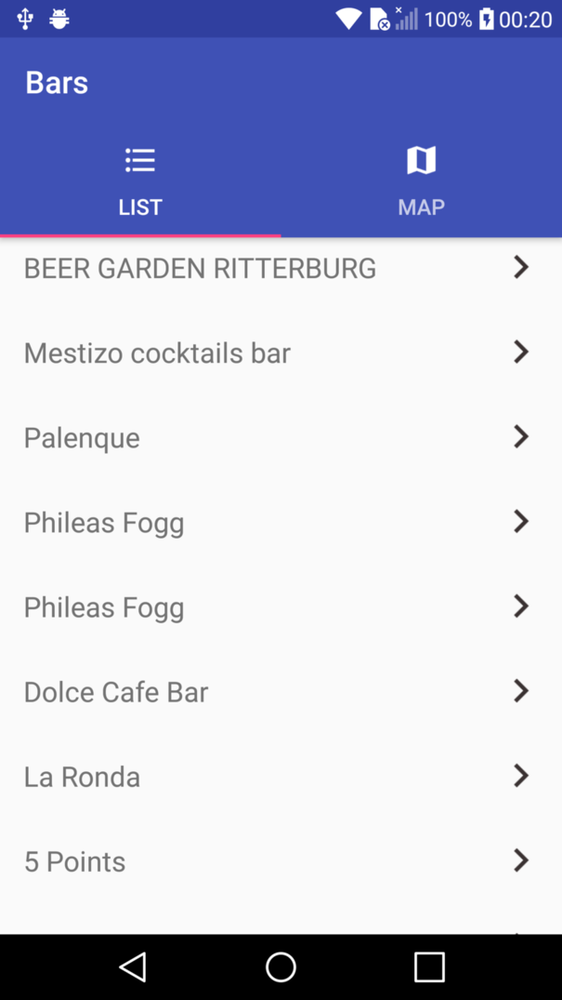
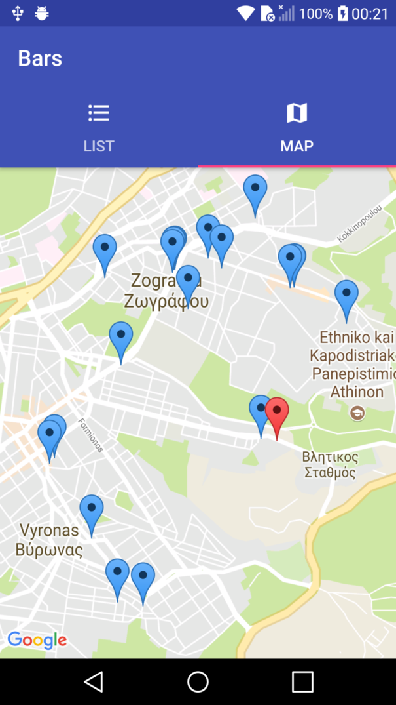

## Tide Places

Technical project for the position of Android developer at [Tide.co](http://www.tide.co).

## Description
This a simple app that based on your location, provides you with nearby bars using the Google places API. The retrieved places are shown both in a list and a map.

## Screenshots

## Architecture
The project architecture is based on the MVP pattern. More specifically, the code structure is separated in three layers :

* **Model:** This layer is responsible for managing data. In this app this layer communicates/interacts with external resources (Network, databases etc) to serve the requested data. 
* **Presenter:** This layer is responsible to interacts to all views requests, querying the Model layer and updating the corresponding view, according to the data provided by model
* **View:** This layer is responsible to present the data as decided by the presenter and querying the presenter when it needs to be updated.

More info about this architecture may be found [here](https://antonioleiva.com/mvp-android/)

## Libraries used
* **Dagger 2**
* **Retrofit**
* **ButterKnife**
* **RxJava 2**
* **RxAndroid**
* **Mockito**

## Getting started
Just clone the project and import it to android studio or in android studio select "New Project from version control -> Github" and fill  the reopository url `https://github.com/latas/TidePlaces.git`

Also, you have to provide an **unrestricted** Google Api Key to `~/app/src/debug/res/values/google_maps_api.xml` with the Google places web API and Android Maps API enabled.

## IDE
Developed in Android studio 3.0 using Gradle 3.0.0

## Developed by
Antonis Latas (latas.ceid@gmail.com) 